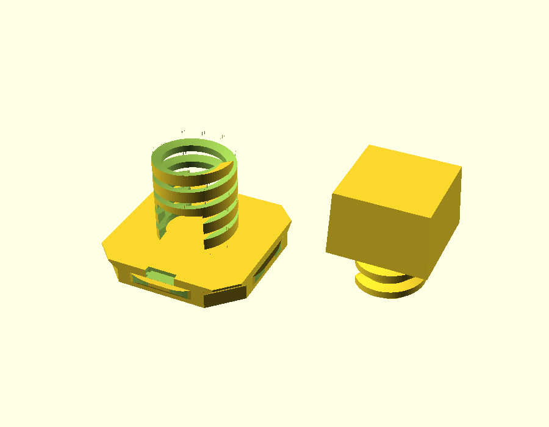
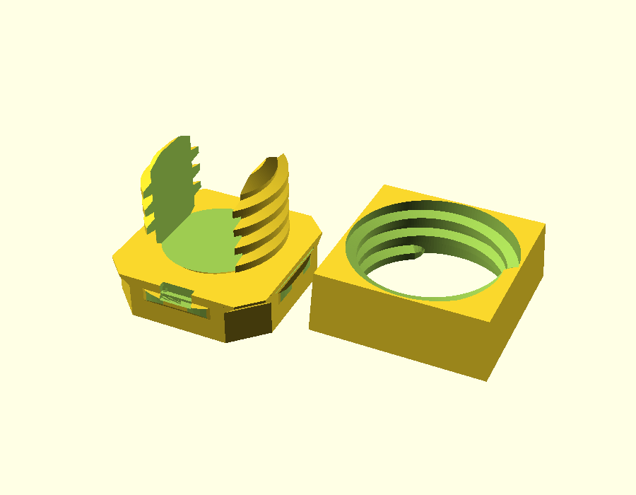
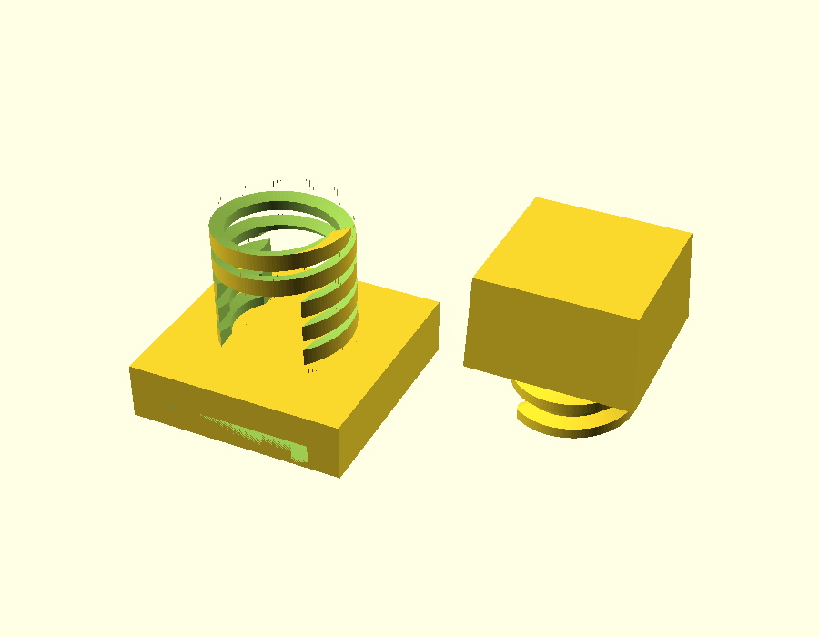
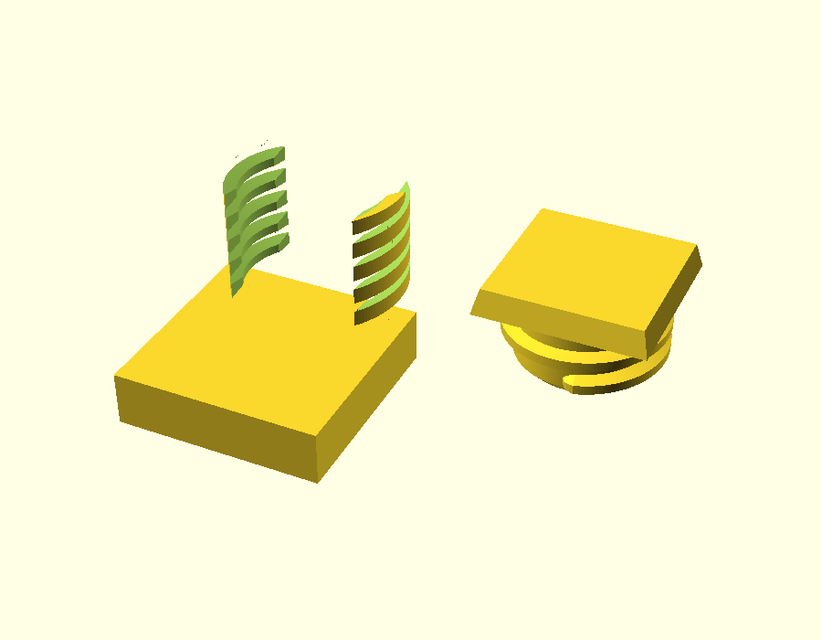

# Cable Clamp Generator

A parametric OpenSCAD generator for a cable clamp that mounts to openGrid/Underware desk systems. It supports three mount systems — openGrid snap (Lite and Full board thickness), openConnect (slide-onto-head), and Multiboard/Multiconnect — with a fully parametric cable bore diameter, thread profile, and a matching regenerated ring nut. Set a bore diameter, choose your mount system and board type, print the Body and the Ring Nut, then lay your cable bundle in the open channel and screw the nut down to cinch. Designed for MakerWorld (OpenSCAD 2026.01.14, Manifold backend) and local OpenSCAD with BOSL2.

---

## Previews

**openGrid Lite — 8 mm bore**

**openGrid Full — 14 mm bore**

**openConnect — 10 mm bore**

**Multiboard — 16 mm bore, 1 slot**

---

## How to print and use

### Parts to print
Set the `Part` parameter in the customizer:

| `Part` value | What you get |
|---|---|
| `Body` | The clamp body with the mount foot; print this first |
| `Ring Nut` | The matching threaded nut; print one per clamp |
| `Both (preview)` | Body and nut side-by-side for preview only (not for printing) |

Print both the Body and Ring Nut for each clamp. No supports are needed for the body in the standard orientation; the ring nut prints flat.

### Assembly
1. Route your cable bundle through the open channel in the clamp body.
2. Thread the ring nut onto the body from above.
3. Tighten the nut until it cinches the cables. The trapezoidal thread gives a secure hold without over-tightening.

### Mount system guidance

| `Mount_System` | How it attaches |
|---|---|
| `openGrid snap` | Drop-in snap fit to an openGrid board. `Board_Type = Lite` uses 4 mm rail thickness; `Full` uses 6.8 mm. The snap clicks onto the rail and can be slid along it. |
| `openConnect` | Slides onto an openConnect head (head_type="slot") mounted on a screw in an openGrid board. In v1 this is a single slot with a fixed slide-on orientation. `OC_Lock` adds a lock tab to prevent the clamp sliding back off. |
| `Multiboard` | Slides onto a Multiboard panel via Multiconnect slots. `MB_Slots` sets the number of engagement slots (1–3). `MB_Dimples` adds retention dimples; `MB_OnRamp` adds the on-ramp chamfer for easier insertion. |

---

## Parameter reference

All parameters are available in the OpenSCAD customizer. Defaults shown below.

### Mount

| Parameter | Default | Description |
|---|---|---|
| `Mount_System` | `"openGrid snap"` | Mount type: `openGrid snap`, `openConnect`, or `Multiboard` |

### openGrid snap

| Parameter | Default | Description |
|---|---|---|
| `Board_Type` | `"Lite"` | Rail thickness: `Lite` (4 mm) or `Full` (6.8 mm) |
| `Snap_Shape` | `"Symmetric"` | Snap profile: `Symmetric` or `Directional` (directional snaps in one axis only) |

### openConnect

| Parameter | Default | Description |
|---|---|---|
| `OC_Lock` | `true` | Add a lock tab that prevents the clamp sliding back off |

In v1, the openConnect mount uses a single slot with a fixed slide-on orientation. Multi-slot and selectable slide direction are not user-adjustable in this release.

### Multiboard

| Parameter | Default | Description |
|---|---|---|
| `MB_Slots` | `1` | Number of Multiconnect slots (1–3); more slots = stronger hold |
| `MB_Dimples` | `true` | Add retention dimples for positive engagement on the Multiboard panel |
| `MB_OnRamp` | `true` | Add chamfered on-ramp at slot entry for easier insertion |

### Cable

| Parameter | Default | Description |
|---|---|---|
| `Cable_Bore_Diameter` | `10` | Inner diameter of the cable channel in mm (range 4–18, step 0.5). Automatically clamped if the chosen mount footprint is too small. |

### Thread

| Parameter | Default | Description |
|---|---|---|
| `Thread_Preset` | `"openGrid standard"` | Thread preset: `openGrid standard`, `Fine`, `Coarse`, or `Custom` |
| `Thread_Pitch` | `3` | Thread pitch in mm — only used when `Thread_Preset = Custom` |
| `Thread_Profile` | `"Trapezoidal"` | Thread profile: `Trapezoidal` or `ISO` — only used when `Thread_Preset = Custom` |
| `Thread_Major_Diameter` | `0` | Thread major diameter override in mm (0 = auto-scale with bore) — only used when `Thread_Preset = Custom` |
| `Thread_Clearance` | `0.4` | Diametral clearance between the body thread and the nut thread in mm. Increase if the nut is too tight on your printer. |

### Ring Nut

| Parameter | Default | Description |
|---|---|---|
| `Nut_Height` | `9` | Height of the ring nut in mm. Must be at least 3× `Thread_Pitch` (ensures ≥3 thread turns). |
| `Nut_Grip` | `"Flats"` | Outer grip style: `Flats` (hex-flat sides), `Knurl` (diamond-knurled band), or `Wings` (extended grip tabs) |

### Output

| Parameter | Default | Description |
|---|---|---|
| `Part` | `"Body"` | What to render: `Body`, `Ring Nut`, or `Both (preview)` |

---

## Print and fit tuning

- **Nut too tight / too loose:** adjust `Thread_Clearance`. The default is `0.4` mm diametral clearance. Increase to `0.5`–`0.6` for looser printers; decrease to `0.3` for very accurate machines. A 0.05 mm step is usually enough to dial in fit.
- **Snap fit too stiff or too loose:** confirm with a test print. The openGrid snap geometry follows the mitufy library's standard dimensions — the only tuning available is `Board_Type` (Lite vs Full).
- **openConnect fit:** the openConnect receiver geometry is derived from `openconnect_head(head_type="slot")` and has not yet been verified by a print against an actual openConnect head/screw assembly. Do a test fit on a short print before committing to a full cable run.
- **Multiboard slot fit:** uses cschneid's `multiconnectSlotDesign.scad` geometry. If insertion or retention is off, try toggling `MB_Dimples` or adjusting `MB_Slots`.
- **Bore clamped warning:** if you see `NOTE: Cable_Bore_Diameter clamped from X to Y mm` in the console, the bore was reduced to fit within the mount footprint. Switch to a larger mount (e.g. `MB_Slots` for Multiboard) or reduce the bore.

---

## Compatibility notes

Key deviations from upstream libraries — see [`../COMPATIBILITY_NOTES.md`](../COMPATIBILITY_NOTES.md) for full detail:

1. **Multiboard library: cschneid, not QuackWorks.** The QuackWorks BOSL2 Multiconnect module renders empty on BOSL2 ≥ 2026-01 (broken `attachable`/`diff()` usage). cschneid's plain-OpenSCAD `multiconnectBack()` is used instead.

2. **Vendored `multiconnectSlotDesign.scad` is modified.** The top-level demo call and six file-level globals were removed and turned into function parameters, so the file is safe to `use <>` and the `MB_Dimples`/`MB_OnRamp` customizer params work correctly. Upstream updates to this file must be re-patched.

3. **openConnect built from `openconnect_head`, not `openconnect_slot_grid`.** `openconnect_slot_grid()` produces non-manifold output under the Manifold backend (MakerWorld). The `openconnect_head(head_type="slot")` approach uses plain CSG and is manifold. Real-world fit with a printed openConnect head/screw is **not yet print-verified**.

4. **openGrid snap T-junctions: watertight on CGAL, not Manifold.** The Manifold backend renders snap geometry without error (MakerWorld is fine), but trimesh's strict watertight check requires the CGAL backend. This is a trimesh-strictness artifact, not a real print defect.

5. **"Knurl" grip uses a `trunc_diamonds` texture.** All three grips (`Flats`, `Wings`, `Knurl`) are fully implemented; the knurl is BOSL2's truncated-diamond texture (flat-topped diamonds for clean printing), verified manifold on the Manifold backend.

6. **Toolchain pins.** Developed and tested on OpenSCAD 2026.01.14 and BOSL2 @ 7e5dfe5 (2026-01-18). BOSL2 is **not bundled** — MakerWorld provides it. Only the mitufy openGrid and cschneid MultiConnect `.scad` files are bundled in this repo.

---

## Attribution and license

**License: CC-BY-NC-SA** (Creative Commons Attribution – NonCommercial – ShareAlike). Inherited from the bundled libraries; commercial use is not permitted.

Credits:
- **David D** — openGrid standard and Multiconnect slot standard
- **Jonathan / Keep Making** — Multiboard standard
- **mitufy** — openGrid snap and openConnect OpenSCAD libraries (CC-BY)
- **Chris Schneider / cschneid** — MultiConnect OpenSCAD library (`multiconnectBack`) (CC-BY-NC)
- **Hands on Katie & BlackjackDuck** — Underware cable management system
- **MakerWorld user_3607339627** — original concept inspiration: [Cable Clamp for OpenGrid / Underware](https://makerworld.com/en/models/1870669)
